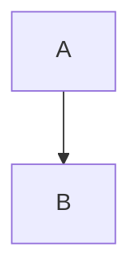

_Этот файл — шпаргалка по Markdown, а также по Mermaid_

# Полезные ссылки

https://skillbox.ru/media/code/yazyk-razmetki-markdown-shpargalka-po-sintaksisu-s-primerami/#stk-22

# Основные элементы синтаксиса Markdown

## Выделение текста

\_Курсив\_ &nbsp; &nbsp; &nbsp; _Курсив_  
\*Курсив\* &nbsp; &nbsp; &nbsp; *Курсив*  
\_\_Жирный\_\_ &nbsp; &nbsp; &nbsp; __Жирный__  
\*\*Жирный\*\* &nbsp; &nbsp; &nbsp; **Жирный**  
\_\_\_Жирный курсив\_\_\_ &nbsp; &nbsp; &nbsp; ___Жирный курсив___  
\*\*\*Жирный курсив\*\*\* &nbsp; &nbsp; &nbsp; ***Жирный курсив***  

> Внутри слова корректно сработает только вариант со звёздочками:
>
> Кор\*рек\*тно, кор\*\*рек\*\*тно, кор\*\*\*рек\*\*\*тно  
> _отобразится как:_  
> Кор*рек*тно, кор**рек**тно, кор***рек***тно
>
> Некор\_рек\_тно, некор\_\_рек\_\_тно, некор\_\_\_рек\_\_\_тно  
> _отобразится как:_  
> Некор_рек_тно, некор__рек__тно, некор___рек___тно

\~\~Зачёркнутый\~\~ &nbsp; &nbsp; &nbsp; ~~Зачёркнутый~~  
Зачёркивание в се~~реди~~не слова работает кор~~рек~~тно  
(к сожалению, работает не во всех диалектах Markdown)

\<u>Подчёркнутый\</u> &nbsp; &nbsp; &nbsp; <u>Подчёркнутый</u>  
(редактор должен поддерживать HTML-теги)

##### Верхний и нижний индексы

abc\^jkl\^ &nbsp; &nbsp; &nbsp; abc^jkl^  
abc\~jkl\~ &nbsp; &nbsp; &nbsp; abc~jkl~  

## Параграфы и разрывы строк

Простой однократный перенос строки не работает как перенос, 
Markdown его не замечает.  
Двукратный перенос строки работает как разделитель между параграфами.  
Если хочется перенести следующую строку без создания нового параграфа, 
нужно в конце текущей строки поставить два пробела, а потом перенос строки.

##### Многократный пробел

"слово \&nbsp; слово" = "слово &nbsp; слово" (тройной пробел получается)  
(к сожалению работает не везде)


## Заголовки

Заголовок указывается с помощью нескольких # подряд в начале строки.  
Всего есть 6 уровней заголовков: от # до ######

> # Заголовок \#
> ## Заголовок \##
> ### Заголовок \###
> #### Заголовок \####
> ##### Заголовок \#####
> ###### Заголовок \######

## Горизонтальный разделитель

Это вот такая черта (взял в цитирование):

> ***

Чтобы оформить горизонтальный разделитель, нужно поставить три или 
больше специальных символа: звёздочки \*, дефиса \- или нижних подчёркивания \_. 

## Цитаты

Чтобы параграф отобразился как цитата, нужно поставить перед ним закрывающую 
угловую скобку >.  
> цитата отображается вот так

Можно делать вложенные цитаты втрого и третьего уровней:

> Цитата первого уровня с помощью одной уголовой скобки >
>> Цитата второго уровня с помощью двух угловых скобок >>
>>> Цитата третьего уровня с помощью трёх угловых скобок >>>

## Списки

#### Нумерованные

Для создания нумерованного списка перед пунктами нужно поставить число с точкой. 
При этом нумерация в разметке ленивая. Неважно, какие именно числа вы напишете: 
Markdown пронумерует список автоматически

5\. Текст  
12\. Текст  
1\. Текст

_превращается в:_

5. Текст
12. Текст
1. Текст

#### Ненумерованные

Для создания ненумерованного списка нужно поставить перед каждым пунктом 
звёздочку \*, дефис - или плюс +.

\* Текст  
\* Текст  
\* Текст  

_превращается в:_

* Текст  
* Текст  
* Текст  

#### Чекбоксы 

\- \[ \] неотмеченный пункт  
\- \[x\] отмеченный пункт

_превращается в:_

- [ ] неотмеченный пункт  
- [x] отмеченный пункт

#### Вложенные

Чтобы создать вложенный список, нужно поставить перед его пунктами табуляцию 
или несколько пробелов. В Markdown одна табуляция соответствует четырём пробелам.

Список одного вида можно вкладывать в любой другой.

#### Другие элементы внутри списков

В пункты списков можно добавлять другие элементы оформления. Например, параграфы 
или цитаты. Для этого нужно сделать отступ, как если бы вы добавляли вложенный 
список.

## Ссылки

\[Яндекс](ya.ru) &nbsp; &nbsp; &nbsp; [Яндекс](ya.ru)  
\[Яндекс](ya.ru "Вслывающая подсказка") &nbsp; &nbsp; &nbsp;
[Яндекс](ya.ru "Вслывающая подсказка")

### Изображения


!\[Изображение](https://upload.wikimedia.org/wikipedia/commons/thumb/4/48/Markdown-mark.svg/1920px-Markdown-mark.svg.png "Логотип Markdown")


## Вставка кода

Внутри строки: пишем \`print(x)\`, получаем `print(x)`

Если хотим блок кода — всего-то надо сделать отступ в одну табуляцию или 
4 пробела (но предыдущая строка должна быть пустой!)

Либо можно обособить блок кода сверху и снизу символами \`\`\`  
Сразу после верхних \`\`\` можно написать имя языка программирования — 
и Markdown подсветит синтаксис.

_Типа_  

\`\`\`cpp  
#include <stdio.h>  
int main() {  
 &nbsp; &nbsp;printf("Hello, World!");  
 &nbsp; &nbsp;return 0;  
}  
\`\`\`

превратится в 
```cpp  
#include <stdio.h>  
int main() {  
	printf("Hello, World!");  
	return 0;  
}  
```


Вот такой [список языков](https://github.com/github-linguist/linguist/blob/master/lib/linguist/languages.yml),
например, поддерживает диалект GitHub Flavored Markdown

## Таблицы
В уже упомянутом выше диалекте GitHub Flavored Markdown (и некоторых других тоже) 
есть возможность оформлять таблицы. Столбцы разделяются вертикальными линиями \|,
а строка с шапкой отделяется от остальных дефисами -, которых можно ставить 
сколько угодно.


	|Столбец 1|Столбец 2|Столбец 3|
	|-|--------|---|
	|Длинная запись в первом столбце|Запись в столбце 2|Запись в столбце 3|
	|Кртк зпс| |Слева нет записи|

_превращается в:_

|Столбец 1|Столбец 2|Столбец 3|
|-|--------|---|
|Длинная запись в первом столбце|Запись в столбце 2|Запись в столбце 3|
|Кртк зпс| |Слева нет записи|

## Экранирование
Многие символы в Markdown выполняют роль служебных. 
Если они встречаются в вашем тексте сами по себе, то для корректного отображения 
их стоит экранировать (иначе они просто не только не отобразятся сами, 
но и добавят вашему тексту какое-нибудь ненужное форматирование). 
Для этого перед ними ставится обратная косая черта \\.

Вот список символов, которые нужно экранировать: \\`*_\{\}[]<>()#+-.! |. 
Делать это постоянно необязательно — достаточно ставить экран только в тех 
случаях, когда Markdown может воспринять эти символы как служебные. 
Например, если строка начинается с символа #, то экранировать её надо — 
потому что программа может решить, что вы хотите сделать заголовок. 
А вот если решётка находится где-то в центре строки, то экранировать ничего 
не надо — редактор поймёт, что тут она просто часть текста.

# Mermaid

Блок кода с пометкой mermaid будет интерпретирован особым образом!

	```Mermaid
		A-->B
	```

